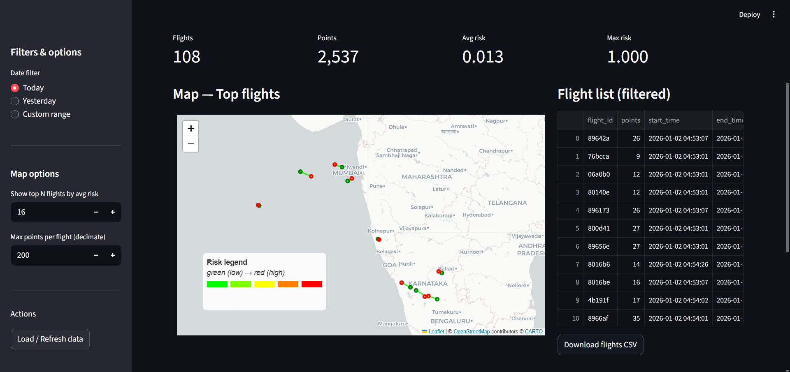

# ✈️ Flight Risk Detection Pipeline

[]() []() []()

> ⚠️ **Disclaimer**  
> This project is for **educational and portfolio purposes only**. It uses **publicly available ADS-B flight data** and does **not** use restricted, private, or sensitive sources. The system is **not intended for operational aviation use, surveillance, or safety decision-making**.

**Author:** NANDHA GOPAL R  
**Reviewed & documented:** Technical review for clarity, parity between batch & stream, and reproducibility.\
**Description:** "Kafka + Spark Structured Streaming + Batch ML — Bronze → Silver → Gold"

---

## 📌 Executive Summary

A production-inspired medallion-style data pipeline that ingests ADS-B aircraft telemetry, persists raw events, cleans and validates data, produces canonical ML features, trains a classifier, and exposes batch + real-time risk scores via a Streamlit dashboard. Designed for reproducibility and demonstration of streaming + batch parity.


## 🏗️ Architecture (visual)

Include `architecture.png` in the repository root for a visual diagram.

```
ADS-B API → Kafka Producer → Kafka Topic
                  ↓
           Spark Streaming
            (Kafka → Bronze)
                  ↓
           Batch Cleaner (Bronze → Silver)
                  ↓
      Validation + Quarantine + Metrics
                  ↓
            Gold Aggregations
                  ↓
       Feature Engineering (Silver → Features)
                  ↓
           Model Training → Saved Model
                  ↓
   Batch Scoring  ←→  Streaming Scoring (real-time)
                  ↓
              Dashboard (Streamlit)
```
**Note (current):** Bronze is implemented using **Apache Parquet** in streaming writes (see `spark/streaming/spark_aircraft_parquet.py`). Delta Lake migration is recommended for production.

---

## 📦 What’s in this repo

- `kafka/producer/adsb_producer.py` — ADS-B polling producer (publishes JSON to Kafka).  
- `spark/streaming/spark_aircraft_parquet.py` — Kafka → Bronze (streaming Parquet).  
- `spark/batch/clean_aircraft_parquet.py` — Robust cleaner (PyArrow fallback).  
- `spark/batch/validate_aircraft_data.py` — Data quality checks, quarantine, metrics.  
- `spark/batch/aggregate_aircraft_daily.py` & `spark_sql_analytics.py` — Gold aggregations & SQL reports.  
- `spark/ml/feature_engineer_ml.py` — Canonical feature engineering (Silver → Features).  
- `spark/ml/train_flight_risk_model.py` — Model training (Logistic Regression).  
- `spark/ml/score_flight_risk.py` — Batch scoring.  
- `spark/streaming/score_flight_risk_stream.py` — Streaming scoring (real-time inference).  
- `dashboards/flight_dashboard.py` — Streamlit UI (map, filters, CSV export).  
- `airflow/dags/flight_risk_pipeline.py` — Airflow DAG for batch orchestration (optional).  
- `scripts/` — helpful start/stop/clean/status utilities.  
- `.env.example`, `requirements.txt`, `README.md`.

---

## 🗂 Repository layout (recommended)

```
aircraft-risk-pipeline/
│
├── airflow/
│   └── dags/
│       └── flight_risk_pipeline.py
│
├── data/
│   ├── bronze/
│   ├── silver/
│   ├── gold/
│   ├── features/
│   ├── models/
│   └── validation/
│
├── kafka/
│   ├── producer/
│   │   └── adsb_producer.py
│   └── consumer/
│       └── flight_consumer.py
│
├── scripts/
│   ├── start_all.sh
│   ├── stop_all.sh
│   ├── clean_all.sh
│   ├── cleanv.sh
│   └── status.sh
│
├── spark/
│   ├── streaming/
│   │   ├── spark_aircraft_parquet.py
│   │   └── score_flight_risk_stream.py
│   │
│   ├── batch/
│   │   ├── clean_aircraft_parquet.py
│   │   ├── aggregate_aircraft_daily.py
│   │   ├── spark_sql_analytics.py
│   │   └── validate_aircraft_data.py
│   │
│   └── ml/
│       ├── feature_engineer_ml.py
│       ├── train_flight_risk_model.py
│       └── score_flight_risk.py
│
├── dashboards/
│   └── flight_dashboard.py
│
├── .env.example
├── requirements.txt
└── README.md
```

---

## 🔧 Key components (file → purpose → recommended action)

| File | Purpose | Action |
|---|---|---|
| `adsb_producer.py` | Polls ADS-B zones & publishes normalized JSON to Kafka | Keep |
| `spark_aircraft_parquet.py` | Kafka → Bronze (Parquet) streaming ingestion | Keep; add watermark & tune triggers |
| `clean_aircraft_parquet.py` | Bronze → Silver cleaner; robust file fallback | Keep |
| `validate_aircraft_data.py` | Data quality checks, metrics, quarantine | Keep |
| `feature_engineer_ml.py` | Canonical features (single source of truth) | Keep; ensure parity with streaming scorer |
| `train_flight_risk_model.py` | Train & persist model (Logistic Regression) | Keep; record model metadata |
| `score_flight_risk_stream.py` | Streaming scoring; per-icao state & scoring | Modify for exact feature parity (3-point rolling avg) |
| `flight_dashboard.py` | Streamlit dashboard for visualization | Keep; align columns & timezone (IST) |
| `flight_risk_pipeline.py` | Airflow DAG for batch orchestration | Keep; adjust start_date & consider SparkSubmitOperator |

---

## 🔑 Canonical feature definitions (must match batch & stream)

To avoid prediction drift, both batch and streaming scorers must compute features exactly the same way:

1. **delta_t** — seconds between consecutive observations for the same `icao24` (type `long`). First observation has `delta_t = null` and is typically excluded.  
2. **segment_km** — haversine distance (km) between consecutive lat/lon points.  
3. **movement_inst** — `segment_km / max(delta_t, 1.0)` (km/s).  
4. **movement_score** — rolling average of `movement_inst` over the last **3** observations (`rowsBetween(-2, 0)`). Use available values if fewer than 3 exist.  
5. **risk_label** (training only) — rule-based label, e.g., `when(movement_score >= 0.7, 1).otherwise(0)`. Document the threshold used.  
6. **features vector** — `[delta_t, movement_score]` assembled for model input.

> **Streaming requirement:** implement the same 3-point smoothing in the streaming scorer (Spark stateful APIs or persistent short history per `icao24`).

---

## 🛠 Environment & prerequisites

- Java JDK 11+  
- Python 3.10+  
- Apache Spark 3.5.x  
- Kafka (local or managed)  
- Optional: Apache Airflow 2.8+  
- Recommended Python packages (see `requirements.txt`): `pyspark`, `pandas`, `pyarrow`, `kafka-python`, `streamlit`, `folium`, `python-dotenv`

---


## ⚙️ Configuration (.env example)

```bash
PROJECT_ROOT=/home/you/aircraft-risk-pipeline
DATA_PATH=${PROJECT_ROOT}/data

KAFKA_BROKER=localhost:9092
KAFKA_TOPIC=aircraft_positions
KAFKA_OUTPUT_TOPIC=flight_risk_scores

BRONZE_PATH=${DATA_PATH}/bronze/aircraft_parquet
SILVER_PATH=${DATA_PATH}/silver/aircraft_cleaned
GOLD_PATH=${DATA_PATH}/gold

FEATURES_PATH=${DATA_PATH}/features
MODEL_PATH=${DATA_PATH}/models/flight_risk_model

BRONZE_CHECKPOINT=${DATA_PATH}/checkpoints/bronze
SCORING_CHECKPOINT=${DATA_PATH}/checkpoints/scoring
```

---

## ▶️ How to run (concise commands)

1. Prepare environment:
```bash
cp .env.example .env
# edit .env
pip install -r requirements.txt
```

2. Start Kafka & Zookeeper (or Docker Compose).

3. Start the ADS‑B producer:
```bash
python kafka/producer/adsb_producer.py
```

4. Start streaming ingestion (Kafka → Bronze):
```bash
/path/to/spark/bin/spark-submit --packages org.apache.spark:spark-sql-kafka-0-10_2.12:3.5.1 \
  spark/streaming/spark_aircraft_parquet.py --kafka localhost:9092 --topic aircraft_positions \
  --output ${BRONZE_PATH} --checkpoint ${BRONZE_CHECKPOINT} --starting-offsets earliest --trigger "10 seconds"
```

5. Batch cleaning:
```bash
/path/to/spark/bin/spark-submit spark/batch/clean_aircraft_parquet.py --input ${BRONZE_PATH} --output ${SILVER_PATH}
```

6. Validate:
```bash
/path/to/spark/bin/spark-submit spark/batch/validate_aircraft_data.py
```

7. Feature engineering & train:
```bash
/path/to/spark/bin/spark-submit spark/ml/feature_engineer_ml.py --input ${SILVER_PATH} --out ${FEATURES_PATH}
/path/to/spark/bin/spark-submit spark/ml/train_flight_risk_model.py --features ${FEATURES_PATH} --model-out ${MODEL_PATH}
```

8. Start streaming scorer (after model trained):
```bash
/path/to/spark/bin/spark-submit --packages org.apache.spark:spark-sql-kafka-0-10_2.12:3.5.1 \
  spark/streaming/score_flight_risk_stream.py --kafka localhost:9092 --in-topic aircraft_positions \
  --out-topic flight_risk_scores --model ${MODEL_PATH} --parquet-out ${GOLD_PATH}/risk_scores/stream \
  --checkpoint ${SCORING_CHECKPOINT}
```

9. Run dashboard:
```bash
streamlit run dashboards/flight_dashboard.py --server.port 8501
```

---

## 📊 Dashboard Preview

The Streamlit dashboard provides a visual overview of aircraft movement analytics and synthetic risk scores.



> Screenshot shown is for demonstration purposes only using synthetic or publicly available data.

---

## ✅ Testing & troubleshooting tips

- If `spark.read.parquet` fails due to mixed timestamp encodings, `clean_aircraft_parquet.py` will fallback to pyarrow+Pandas; ensure `pyarrow` installed.
- For small file mitigation, apply `.repartition("date")` before writes or increase micro-batch aggregation.
- If streaming jobs unexpectedly stop, check checkpoint directories and Kafka consumer logs.
- Check `logs/` and `run/` pidfiles via `scripts/status.sh`.

---

## 🔭 Future improvements (suggested follow-ups)

- Use Spark stateful operations or external KV (Redis) for robust stream state instead of JSON file.
- Add model drift monitoring and auto-retraining pipelines.
- Add containerized local dev environment (Docker Compose).
- Add CI/CD for Spark jobs (unit tests, pre-commit, GitHub Actions).
- Move storage to cloud (S3/BigQuery) for scale.

